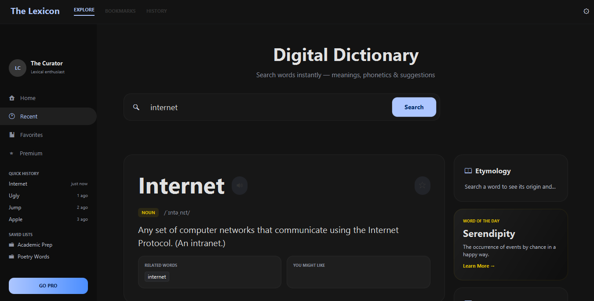
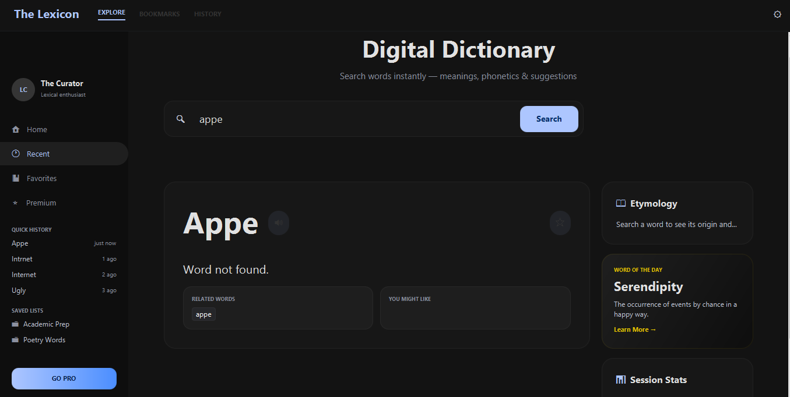

# Digital Dictionary App

A JavaFX-based Digital Dictionary application with:
- Word Search
- Prefix Suggestions
- Auto-Correct
- API Meaning Fetching
- Trie, Heap, HashMap, TreeMap Data Structures

## Technologies Used
- Java
- JavaFX
- JSON Library
- Dictionary API

## Features
- Fast word lookup using Trie
- Spelling correction using Heap
- Search frequency count using HashMap
- Word categories using TreeMap

## Run Command

javac --module-path "C:\javafx-sdk-25\lib" --add-modules javafx.controls -cp "lib/json-20231013.jar" -d bin src/dictionary/*.java

java --module-path "C:\javafx-sdk-25\lib" --add-modules javafx.controls -cp "bin;lib/json-20231013.jar" dictionary.DictionaryFXApp

## Screenshots

### Home Screen

### Search Result

# Word not Found
